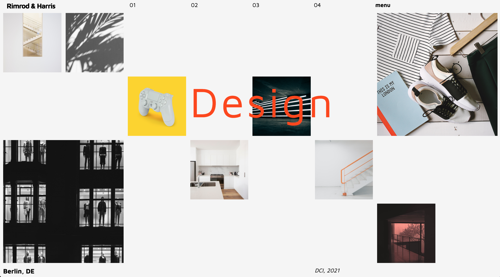

# Grid Design Studio

You've just been tasked with creating the new homepage for the _Rimrod & Harris_ design studio. Below is the mockup the designer just sent you for the site -

Looks like a job for **CSS Grid**, right?

#### Instructions

> - Use the _Maven Pro_ font from **Google Fonts**
> - Don't worry about responsivity at the moment - just concentrate on the desktop layout
> - All images are located in the **assets** folder
> - There are many ways to do this! A nested grid might be useful..
> - Get as close to 'pixel perfect' as possible :)
