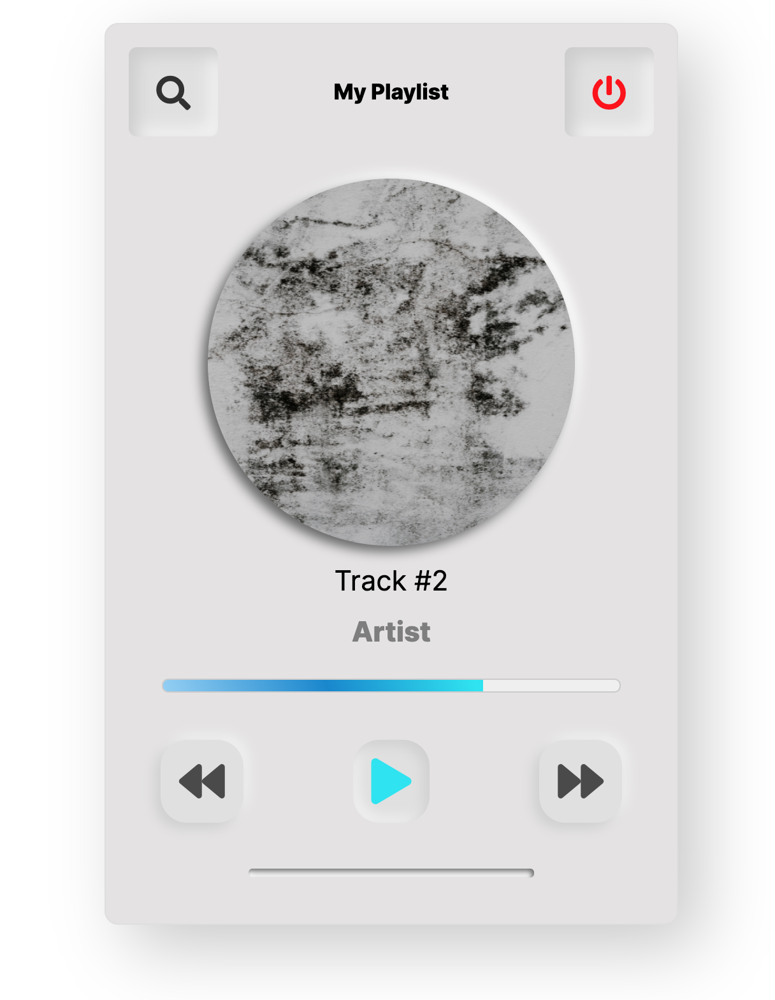

# Neumorphic Music Player

Let's polish up our UI skills and practice Flexbox layouts by creating the music player shown below -

### Instructions

> - All of the icons are from **Fontawesome**
> - The font we are using is _Inter_ from **Google Fonts**
> - Feel free to add a photo of an artist you like and include the artist and track name in the player
> - Mind the small details! Use different font weights and don't forget to create a `linear-gradient` for the track progress bar
> - To help with the neumorphic elements, you can use the generator [here](https://neumorphism.io/#e0e0e0)
> - As always, **pixel perfect** :)
